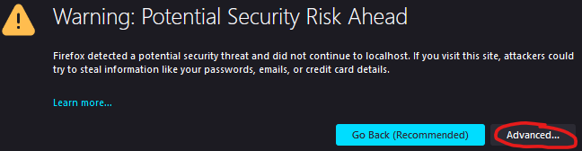
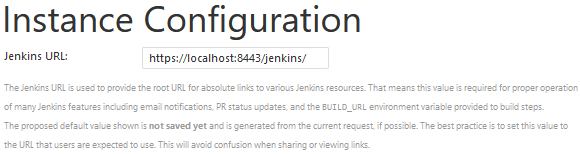
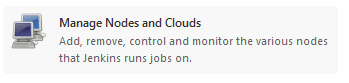

This repo depicts Jenkins Setup on a local machine, once on WSL2 with an Ubuntu 20.04 LTS and once on Docker with Docker-Compose

# Prerequisites

## Router Port-Forwarding

This example will deploy jenkins on your local machine. By default, the outside world can't communicate with your local applications.
Jenkins must be reachable fromm the internet because later on Jenkins will be secured through Azure Active Directory and Jenkins will be triggered by GitHub Webhooks. 

Example on a "AX1500 Wi-Fi 6 Router":  
Log in http://192.168.1.1/  
navigate to Advanced > NAT Forwarding > Port Forwarding  

[direct link](http://192.168.1.1/webpages/index.html?t=0a3ee1bc#portForwarding)

## Azure Active Directory
[Create an azure account](https://docs.microsoft.com/en-us/learn/modules/create-an-azure-account/).
The azure account comes with a free tier Azure Active Directory. We will use this later on to secure Jenkins.  


## GitHub account
In your GitHub account you will create two projects. One of them will trigger Jenkins builds. More on that later on.

## Noip Account

https://www.noip.com/  
Register a hostname here. Example:  

This will allow you to access Jenkins later on through a domain name instead of IP Address. Required for securing Jenkins through Azure Active Directory.


# WSL2 - Ubuntu 20.04 LTS

In this section we'll set up Jenkins on WSL2 with Ubuntu 20.04 LTS. The setup will be made out of:
- 1x master node
- 1x worker node
- [Security Through Azure Active Directory](https://plugins.jenkins.io/azure-ad/)
- mail notifications


- get your WSL IP and map it to jenkins.local in Windows's hosts file

## Create master and worker Ubuntu 20.04 instances

In this step it is assumed, that there are no Ubuntu 20.04 LTS WSL2 Instances running.

```bash
# In Windows: edit hosts file, add
172.17.249.53 jenkins.local # IP will change over time... If you plan to use this solution then make sure the IP does not change.
```

First create the base image. It will contain a JRE and net tools.
```powershell
# Powershell
wsl --install --distribution Ubuntu-20.04
username: ubuntu
password: <whatever you wish, but make a note of it!> 
# close the new terminal, go your to powershell
exit
```
```bash
# Powershell
wsl -d Ubuntu-20.04

# Bash
sudo apt-get update
sudo apt-get upgrade -y
sudo apt install net-tools -y

# set up JRE
JRE_VERSION='11.0.15_8'
JRE_DIR="openjdk-${JRE_VERSION}-jre"
JRE_BIN="/opt/${JRE_DIR}/bin"
JRE_ARCHITECTURE='x64'
# for Raspberry PI: JRE_ARCHITECTURE='aarch64' 
wget "https://github.com/AdoptOpenJDK/openjdk11-upstream-binaries/releases/download/jdk-11.0.15%2B8/OpenJDK11U-jre_${JRE_ARCHITECTURE}_linux_${JRE_VERSION}_ea.tar.gz" -O /tmp/openjdk.tar.gz
sudo tar xzvf /tmp/openjdk.tar.gz -C /opt/
sudo ln -sf ${JRE_BIN}/java /bin/java
java -version
sudo tee /etc/apache2/other/$NAME.conf &>/dev/null <<EOF
if [ -d "/opt/.local/bin" ] ; then
    PATH="$HOME/.local/bin:$PATH"
fi
EOF
# this is a little trick to always log in as ubuntu instead of root on the newly created wsl instances based on this instance:
sudo tee /etc/wsl.conf <<EOF
[user]
default=ubuntu
EOF
exit
```

```powershell
# Powershell
wsl --terminate Ubuntu-20.04
wsl --export Ubuntu-20.04 Ubuntu-20.04.base.tar
```

Next, create the master and the worker instances.
```powershell
# Create the master node
wsl --import Ubuntu-20.04-jenkins-master .\Ubuntu-20.04-jenkins-master Ubuntu-20.04.base.tar
# In Windows: Create worker 1 from the base. Further workers can be created in the same way, just replace "worker-1" with something else, like "worker-2". You can also just back up the worker after it is set up and create a new one from the backup.
wsl --import Ubuntu-20.04-jenkins-worker-1 .\Ubuntu-20.04-jenkins-worker-1 Ubuntu-20.04.base.tar
# this is a little trick to always log in as ubuntu instead of root on the newly created wsl instances:
```

Onward to configuring the master node, where we will download Jenkins into the master node and generate the master node's ssh key.
The key will be used to communicate through ssh with the worker node.

```bash
# Powershell
wsl -d Ubuntu-20.04-jenkins-master
# Bash
cd ~
# Download Jenkins
wget https://get.jenkins.io/war-stable/2.332.2/jenkins.war

# need an ssh key to communicate with worker. Put a password on it for good measure and memorize it!
ssh-keygen -f /home/ubuntu/.ssh/ubuntu-20.04-jenkins-master

# Jenkins will be running on a secure channel. The SSL Certificate will be self-signed...
# If you have the money for it get the certificate signed by some Certificate Authority, but for the example's sake it won't be signed and your browser will show it as such/.
# fill out the forms as needed:
openssl req -x509 -sha256 -nodes -days 365 -newkey rsa:2048 -keyout ubuntu-20.04-jenkins-master.key -out ubuntu-20.04-jenkins-master.crt
openssl pkcs12 -export -out ubuntu-20.04-jenkins-master.pfx -inkey ubuntu-20.04-jenkins-master.key -in ubuntu-20.04-jenkins-master.crt # PW in example: mypassword, used at jenkins startup
/opt/openjdk-11.0.15_8-jre/bin/keytool -importkeystore -srckeystore ubuntu-20.04-jenkins-master.pfx -srcstoretype pkcs12 -destkeystore ubuntu-20.04-jenkins-master.jks -deststoretype JKS  # PW in example: mypassword, used at
rm ubuntu-20.04-jenkins-master.key ubuntu-20.04-jenkins-master.crt ubuntu-20.04-jenkins-master.pfx

# Register Jenkins as a service:

# Create the startup script:
vi /home/ubuntu/ubuntu-20.04-jenkins-master-start.sh
#!/bin/bash
java -jar ~/jenkins.war --prefix=/jenkins -httpPort=-1 --httpsPort=8443 --httpsKeyStore=/home/ubuntu/ubuntu-20.04-jenkins-master.jks --httpsKeyStorePassword=mypassword
:wq

chmod u+x /home/ubuntu/ubuntu-20.04-jenkins-master-start.sh
nohup /home/ubuntu/ubuntu-20.04-jenkins-master-start.sh &>jenkins.log &
# Access Jenkins under https://localhost:8443/jenkins/

```


Set up the worker
```bash
# Powershell
# Get the master node public:
wsl -d Ubuntu-20.04-jenkins-master cat /home/ubuntu/.ssh/ubuntu-20.04-jenkins-master.pub  
# Copy the contents, you'll need them next in the worker node:
wsl -d Ubuntu-20.04-jenkins-worker-1
# Bash
mkdir -p ~/.ssh
vi ~/.ssh/authorized_keys
# add public key content from master in this file
:wq

# ssh server
sudo ssh-keygen -A
sudo service ssh status # check status... might not be running
sudo service ssh start # if not running 
exit
```

### Set up Jenkins

#### Global Configuration

Navigate to https://localhost:8443/jenkins/  
Jenkins will ask for the initial password. You can get it by executing `wsl -d Ubuntu-20.04-jenkins-master cat /home/ubuntu/.jenkins/secrets/initialAdminPassword` in Powershell. 

Next, Jenkins will offer a fast-paced configuration and a customized configuration.  
  
If you are unfamiliar then choose the suggested plugins. My personal favorites:  
  
I usually remove Gradle and Ant, because I rarely work on those types of projects.  
You can install / remove plugins after this step is done too, don't worry much about it much.  

Next, Jenkins will want you to create an administrator user:  
  
Create an admin user for now. 

Next is the instance configuration:  
for now leave it as it is.  


Save and Finish

  
According to Jenkins you are all done, but we're not done yet... We still want to set up security, connect a node, set up smtp server, create some jobs etc.

Go to Manage Jenkins -> Configure System

Here, set the # of executors to 0. It is a good practice to never build on the master node. Builds will be delegated to worker nodes.  
Set Labels to master  
Set Usage to "Only build jobs with label expressions matching this node"  
set the System Admin e-mail address to your e-mail address  
  

Set GitHub, Add GitHub Server  
  
In the credentials click on the question mark to get instructions and follow them.
Test the connection to make sure it works.

E-mail Notification (not to be confused with the Extended E-mail Notification!)

Click advanced for additional config options.

SMTP server → smtp.gmail.com  
Select Use SMTP Authentication  
Put your gmail id  
Put your gmail app password # READ THIS!!: https://support.google.com/accounts/answer/185833  
Use SSL select  
SMTP port 465  
Save the configuration  

Test the configuration by sending yourself a mail.

#### Security

This is not a best practice, far from it, but it will suffice for the time being:  
Manage Jenkins -> Configure Global Security  


#### Worker Node Coupling

Manage Jenkins -> Manage nodes and clouds -> New node  
name the worker: Ubuntu-20.04-jenkins-worker-1  
Permanent Agent


On the next page, add a meaningful description, like "Ubuntu-20.04 WSL2 worker node 1"  
Number of executors: 2  (no reason why 2, can be more now, this is not a production environment)  
Remote root directory: "/home/ubuntu"  
Label: "worker amd64".  
* worker: because it will be grouped as a worker
* amd64 because the processor is an amd64 processor. if the worker were for example a Raspberry PI, then the label should be aarch64  
  This is important when installing software (like JDK) built for different architectures.

**Launch method**: Launch via SSH  
Host: Since we're using WSL2, we don't have any dedicated IPs. The IP can change every time you restart your PC.
For the exercise's sake just find the IP by executing the following command:
```powershell
wsl -d Ubuntu-20.04-jenkins-worker-1 ifconfig
```
search for the inet under eth0 and use that IP.

Again, please keep in mind, that this IP will change and you will have to set it again and again if you are using WSL.

**Credentials**:

Add the SSH private's content key from under on the master node: `/home/ubuntu/.ssh/ubuntu-20.04-jenkins-master`.  
`wsl -d Ubuntu-20.04-jenkins-master cat /home/ubuntu/.ssh/ubuntu-20.04-jenkins-master`  
Kind: SSH Username with private key  
Scope: System  
ID: master-node-private-key  
Description: The master node's private key  
Username: ubuntu  
Private key: contents of `/home/ubuntu/.ssh/ubuntu-20.04-jenkins-master`  
Passphrase: the passphrase for `/home/ubuntu/.ssh/ubuntu-20.04-jenkins-master`

**Troubleshooting**:  
You might still not be able to connect to the worker node, getting following exception over and over:
```log
SSH Connection failed with IOException: "Connection refused (Connection refused)", retrying in 15 seconds. There are 9 more retries left.
```
In this case make sure that you can actually ssh over from the master to the worker node:
```powershell
wsl -d Ubuntu-20.04-jenkins-master ssh -i ~/.ssh/ubuntu-20.04-jenkins-master ubuntu@IP-OF-WORKER-NODE
```
if you get the following error :
```log
ssh: connect to host IP-OF-WORKER-NODE port 22: Connection refused
```
then it might be because the ssh agent on the worker node is not started!
Trace your setup back to the worker node setup, and make sure, that the ssh agent is started:
```bash
wsl -d Ubuntu-20.04-jenkins-worker-1
sudo ssh-keygen -A
sudo service ssh status # check status... might not be running
sudo service ssh start # if not running
```

```powershell
# cleanup wsl
wsl --unregister Ubuntu-20.04-jenkins-master
wsl --unregister Ubuntu-20.04-jenkins-worker-1
```


#### References
- https://www.jenkins.io/doc/book/installing/
- https://get.jenkins.io/
- https://get.jenkins.io/war-stable/2.332.2/

### Docker
```bash
# need a .jenkins folder under the path given
keytool -genkey -keyalg RSA -alias selfsigned -keystore jenkins_keystore.jks -storepass mypassword -keysize 2048
# copy keystore under  C:\work\.jenkins
docker run -d --rm --name master --env JENKINS_OPTS="--prefix=/jenkins" --restart always -p 443:8443 -v C:\work\.jenkins:/var/jenkins_home jenkins/jenkins:lts-jdk11 --httpPort=-1 --httpsPort=8443 --httpsKeyStore=/var/jenkins_home/jenkins_keystore.jks --httpsKeyStorePassword=mypassword

# run in only http:
docker run -d -p 8080:8080 -p 50000:50000 --env JENKINS_OPTS="--prefix=/jenkins" --restart always -v C:\work\.jenkins:/var/jenkins_home jenkins/jenkins:lts-jdk11

# for other workers you'd need to create docker network bridges
```

### Docker Compose

Fast-forward...
```powershell
wsl --import Ubuntu-20.04-docker-compose .\Ubuntu-20.04-docker-compose Ubuntu-20.04-24.04.2022.17.00.tar
wsl -d Ubuntu-20.04-docker-compose
docker-compose up -d
docker-compose down
```

see [docker-compose.yaml](docker-compose.yaml)

