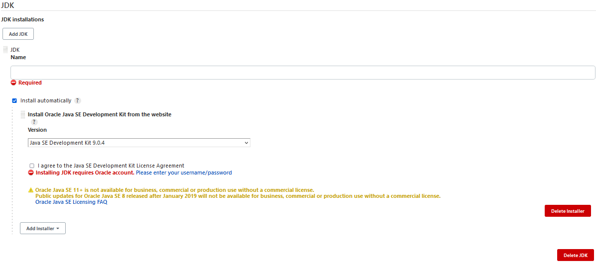
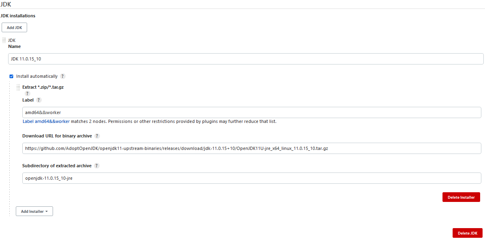
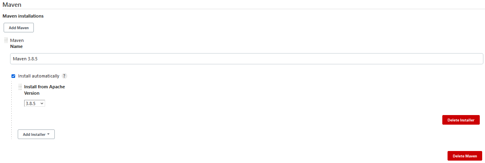

# Build Tools

The project [simple-java-maven-app](https://github.com/jenkins-docs/simple-java-maven-app) is a java project, with maven.
Before we can build it needs a JDK and Maven on the worker nodes, otherwise the project cannot be built.
There are multiple ways on how this can be done. One way is to simply log on all worker nodes, one after another and manually install a JDK and a maven. Since this is counter productive, we will do it in another way. We will instruct Jenkins to install the correct tool on the correct worker node. From there on Jenkins then will install the tools automatically and only when the tool is missing on the node.

## JDK 

We will instruct Jenkins to install [JDK version 11.0.15_8 from AdoptOpenJDK's GitHub](https://github.com/AdoptOpenJDK/openjdk11-upstream-binaries/releases/download/jdk-11.0.15+10/OpenJDK11U-jre_x64_linux_11.0.15_10.tar.gz).  
To do that we will open up Jenkins in browser: https://localhost:8443/jenkins.  
Onl the left side in the Menu, select Manage Jenkins. Afterwards go to Global Tool Configuration.  
Search for the JDK installations. Press Add JDK. Delete the preconfigured installer by pressing "Delete Installer".

Add the new installer "Extract *.zip/*.tar.gz"

For the Name just add `JDK 11.0.15_10`.    
For Label we will use `amd64&&worker` The label comes from the worker nodes. Remember when we configured multiple labels? This is the time when we are going to use them to restrict this tool's installation on worker nodes labeled with amd64 and worker in the same time. Labels are useful when we want to direct the installation of tools on specific worker nodes.  
For example we might have a Raspberry PI which is an aarch64 architecture. Instead of amd64 JDK we would have to install aarch64 JDK.
In the URL just add https://github.com/AdoptOpenJDK/openjdk11-upstream-binaries/releases/download/jdk-11.0.15+10/OpenJDK11U-jre_x64_linux_11.0.15_10.tar.gz  
Subdirectory of extracted archive will be set to `openjdk-11.0.15_10-jre`. This directory can be found in the archive downloaded by jenkins. It contains the bin directory where the executables reside. Jenkins will set java's home folder to this directory.  
Press save and you are done.

## Maven

Jenkins will be instructed to install Maven on worker nodes where there isn't one already.  
We navigate to Manage Jenkins > Global Tool Configuration.  
Here there's a section with Maven Installations. Click on Add Maven.  
For the name add Maven 3.8.5 and select 3.8.5 from the "Install from Apache Version".  
That's it! press save and you are done.  

