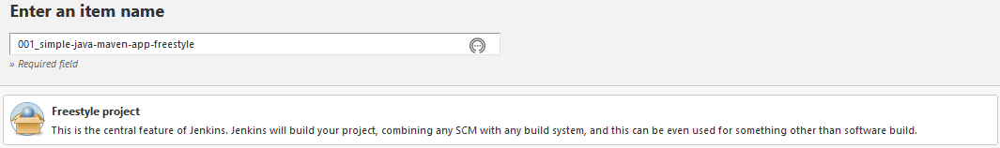
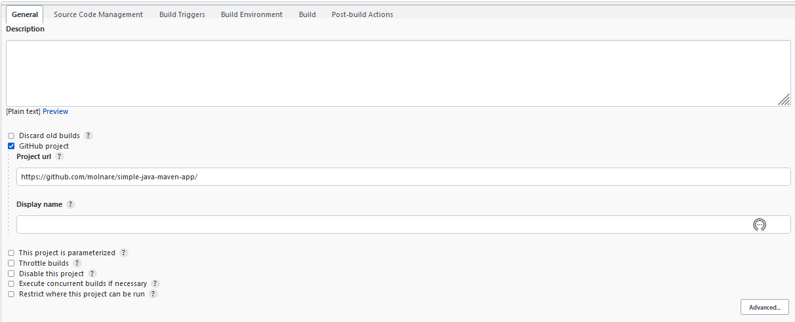

# Freestyle Job

Starting off with Jenkins this is the most basic job we can create. Freestyle jobs are decent for simple continuous integration, but not suitable to define the whole lifecycle of an application. Since we don't have a complex application, we will build the forked [simple-java-maven-app](https://github.com/jenkins-docs/simple-java-maven-app) through a freestyle job .

We will open Jenkins in the browser: https://localhost:8443/jenkins/  
On the left side, press `New Item`.  
We can name the job `001_simple-java-maven-app-freestyle` (or whatever else we want).  
Select `Freestyle project` for the type and then press ok. 

On the next page we get a form to fill.  

## General

Under General Tab select GitHub Project, since that is what we are building.  
For Project url add the URL of the forked simple-java-maven-app. In my case it is https://github.com/molnare/simple-java-maven-app. You will have to replace the molnare part.  
Leave everything else as it is.  

## Source Code Management

Onwards to Source Code Management...
select Git as Source Code Management. 
For the Repository URL we will add the URL towards the forked simple-java-maven-app. It should look something similar like this: https://github.com/molnare/simple-java-maven-app.git molnare being my GitHub page, you will have to switch that with yours.  
For Credentials we can now use the GitHub credentials we configured in the [GitHub personal access token](../credentials/github-personal-access-token.md) section.
In the Source Code Management section you can leave everything else as it is.

##  Build triggers 
Activate GitHub hook trigger for GITScm polling. This will enable GitHub webhooks to trigger builds on our Jenkins.

## Build Environment
Activate Delete workspace before build starts. On small projects this is OK. On bigger projects we might rethink the strategy and use something like `git clean -fdx` before build starts just to speed up the process.

## Build
Add a new "Invoke top-level Maven targets" here.  
Select the Maven configured in [build-tools](../build-tools.md).  
For the goals you can use `clean package`.

## Post-build Actions
Add Publish JUnit test result report so we have some JUnit reports shown in the build as a nice graph.  
Under Test report XMLs add `**/target/surefire-reports/TEST-*.xml`.
Save the configuration and run the job.  