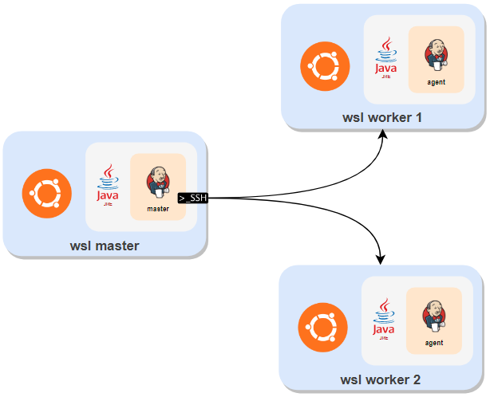
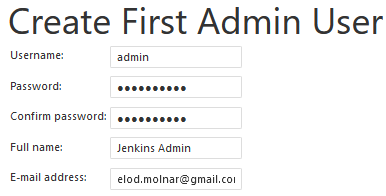
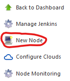
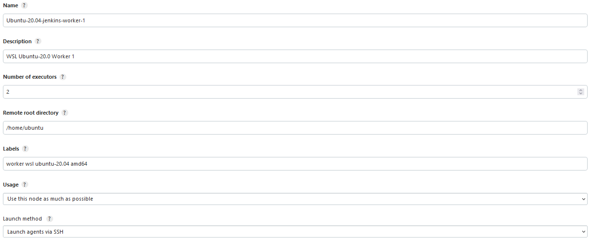
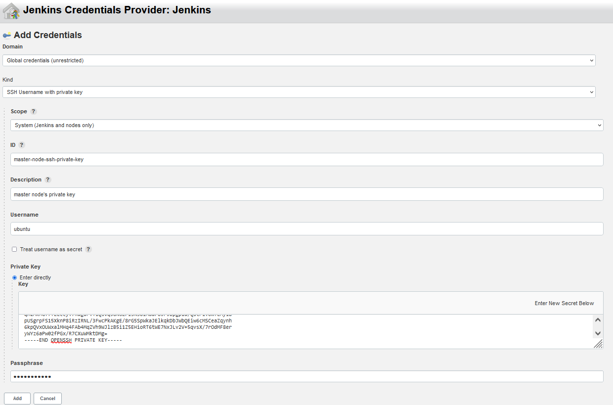
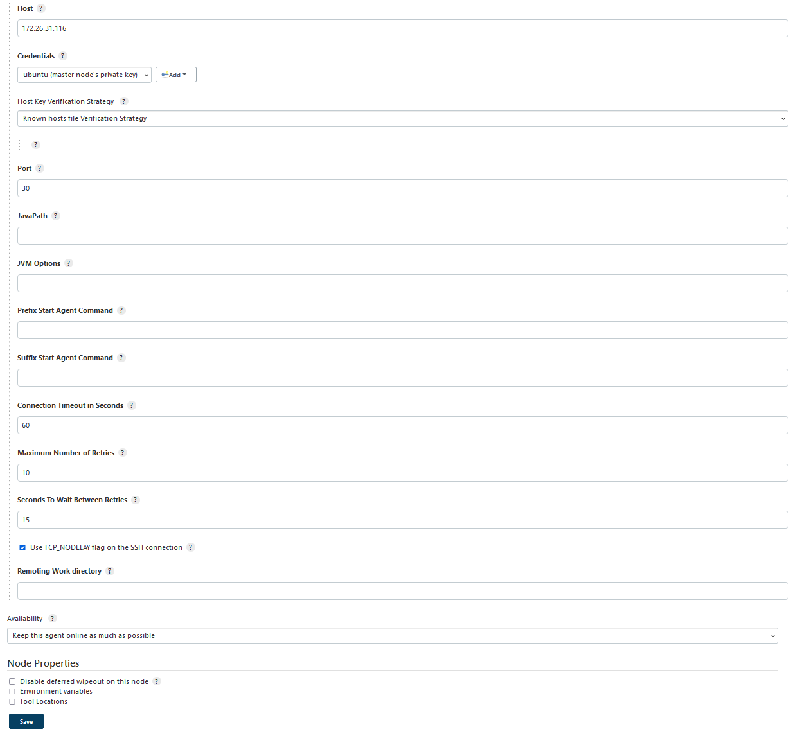
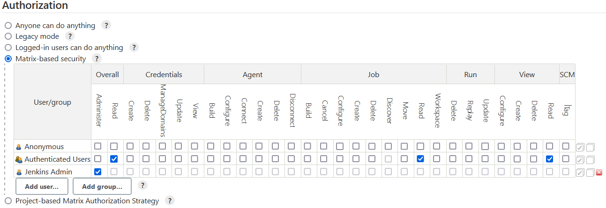

# Jenkins with WSL

In this section we are going to set up a master instance Jenkins with two workers on a local Windows in WSL. At the end we will have the following setup locally:



# Prerequisites

* Windows 10 version 2004 and higher (Build 19041 and higher) or Windows 11
* WSL2 installed ([installation guide can be found here](https://docs.microsoft.com/en-us/windows/wsl/install))
* Optional: PowerShell Core. We can download it from Microsoft's official GitHub [PowerShell Core repository](https://github.com/PowerShell/PowerShell).

# Assumptions

* No previous Ubuntu instance is installed.

# Base

First we will create the base for our Jenkins setup, which will consist of a Ubuntu 20.04 LTS with a JRE 11.0.15_10 and net tools installed on it. The net tools will be needed later to find out the IP address of instances. 
```powershell
# Powershell
wsl --install --distribution Ubuntu-20.04
# The wsl console will open in a new popup, asking to introduce the initial username and password. 
# username: ubuntu
# password: <whatever you wish, but make a note of it!>
# close the new terminal by typing exit
exit
```

Next we will switch to our new Ubuntu WSL Instance, and inside we will download and configure a JRE, and make sure, that every time we switch to any Ubuntu instances based on this one we will always be logged in with the `ubuntu` user instead of root.

```bash
# Powershell
wsl --distribution Ubuntu-20.04

# Bash
# update the system
sudo apt-get update
sudo apt-get upgrade -y
# install net tools
sudo apt install net-tools -y

# set up JRE
JRE_VERSION='11.0.15_10'
JRE_DIR="openjdk-${JRE_VERSION}-jre"
JRE_BIN="/opt/${JRE_DIR}/bin"
JRE_ARCHITECTURE='x64'
# just making a note here, for Raspberry PI set: JRE_ARCHITECTURE='aarch64' 
wget "https://github.com/AdoptOpenJDK/openjdk11-upstream-binaries/releases/download/jdk-11.0.15%2B10/OpenJDK11U-jdk_${JRE_ARCHITECTURE}_linux_${JRE_VERSION}.tar.gz" -O /tmp/openjdk.tar.gz
sudo tar xzvf /tmp/openjdk.tar.gz -C /opt/
sudo ln -sf ${JRE_BIN}/java /bin/java
java -version
# this is a little trick to always log in as ubuntu instead of root on the newly created wsl instances based on this instance:
sudo tee /etc/wsl.conf <<EOF
[user]
default=ubuntu
EOF
exit
```

At this point we have the base setup ready and it is time to create a backup. 

```powershell
# Powershell
wsl --terminate Ubuntu-20.04
wsl --export Ubuntu-20.04 Ubuntu-20.04.base.tar
```

# Master and Worker Instance Creation

Next, create the master and the two worker instances from the previously created backup.
```powershell
# Create the master instance
wsl --import Ubuntu-20.04-jenkins-master .\Ubuntu-20.04-jenkins-master Ubuntu-20.04.base.tar
# Create worker 1 and 2 from the backup. Further workers can be created in the same way, just replace "worker-1" with something else, like "worker-3".
wsl --import Ubuntu-20.04-jenkins-worker-1 .\Ubuntu-20.04-jenkins-worker-1 Ubuntu-20.04.base.tar
wsl --import Ubuntu-20.04-jenkins-worker-2 .\Ubuntu-20.04-jenkins-worker-2 Ubuntu-20.04.base.tar
```

We should have our 3 WSL instances by now. If we wish, we can list them all by executing the following command:
```powershell
> wsl --list
Ubuntu-20.04
Ubuntu-20.04-jenkins-master
Ubuntu-20.04-jenkins-worker-1
Ubuntu-20.04-jenkins-worker-2
```

# Master Instance Setup
We are ready to configure the master instance. We will need to do the following:
* download Jenkins into the master instance 
* generate the master instance's ssh public and private key The ssh keys will be important later when we enable communication between master and worker instances through ssh
* generate self-signed ssl certificates for Jenkins. We will use the ssl certificates to run Jenkins on https
* start Jenkins

```bash
# Powershell
wsl -d Ubuntu-20.04-jenkins-master
# Bash
cd ~
# Download Jenkins
wget https://get.jenkins.io/war-stable/2.332.2/jenkins.war

# we need an ssh key to communicate with the worker instances. Put a password on it for good measure and memorize it!
ssh-keygen -f /home/ubuntu/.ssh/ubuntu-20.04-jenkins-master

# Jenkins will be running on a secure channel. The SSL Certificate will be self-signed...
# If you have the money for it get the certificate signed by some Certificate Authority, but for the example's sake it won't be signed and your browser will show it as such.
# fill out the forms as needed:
openssl req -x509 -sha256 -nodes -days 365 -newkey rsa:2048 -keyout ubuntu-20.04-jenkins-master.key -out ubuntu-20.04-jenkins-master.crt
# Country Name (2 letter code) [AU]:RO
# State or Province Name (full name) [Some-State]:Cluj
# Locality Name (eg, city) []:Cluj-Napoca
# Organization Name (eg, company) [Internet Widgits Pty Ltd]:msg
# Organizational Unit Name (eg, section) []:automotive
# Common Name (e.g. server FQDN or YOUR name) []:elod.ddns.net
# Email Address []: elod.molnar@gmail.com
#
# Optionally if we have a way to get a signed certificate (I got one by being "eligible" on noip for some reason):
# 1. We must generate the certificate sign request. The following command will generate a certificate sign request and the corresponding private key:
#    openssl req -newkey rsa:2048 -keyout elod.ddns.net.key -out elod.ddns.net.csr
# 2. Get the csr signed!
# 3. The certificate authority will send a chain trust file back in a pem file, containing the root, the intermediate and the server certificates. We have to put it and the private key into a jks. First create the p12 keystore:
#    openssl pkcs12 -export -in elod_ddns_net.pem-chain -inkey elod.ddns.net.key -out elod.ddns.net.certandkey.p12 -name elod.ddns.net -CAfile elod_ddns_net.pem-chain
# 4. Then convert the p12 keystore in a java key store
#    keytool -importkeystore -deststorepass mypassword -destkeypass mypassword -destkeystore ubuntu-20.04-jenkins-master.jks -srckeystore elod.ddns.net.certandkey.p12 -srcstoretype PKCS12 -srcstorepass mypassword -alias elod.ddns.net
openssl pkcs12 -export -out ubuntu-20.04-jenkins-master.pfx -inkey ubuntu-20.04-jenkins-master.key -in ubuntu-20.04-jenkins-master.crt # PW in example: mypassword, used at jenkins startup
/opt/openjdk-11.0.15_10-jre/bin/keytool -importkeystore -srckeystore ubuntu-20.04-jenkins-master.pfx -srcstoretype pkcs12 -destkeystore ubuntu-20.04-jenkins-master.jks -deststoretype JKS  # PW in this example: mypassword  
# clean up unnecessary files 
rm ubuntu-20.04-jenkins-master.key ubuntu-20.04-jenkins-master.crt ubuntu-20.04-jenkins-master.pfx

# Create the startup script:
vi /home/ubuntu/ubuntu-20.04-jenkins-master-start.sh
#!/bin/bash
java -jar ~/jenkins.war --prefix=/jenkins -httpPort=-1 --httpsPort=8443 --httpsKeyStore=/home/ubuntu/ubuntu-20.04-jenkins-master.jks --httpsKeyStorePassword=mypassword
:wq
# further initial parameter infos on Jenkins website: https://www.jenkins.io/doc/book/installing/initial-settings/

chmod u+x /home/ubuntu/ubuntu-20.04-jenkins-master-start.sh
nohup /home/ubuntu/ubuntu-20.04-jenkins-master-start.sh &> ~/jenkins.log &
# Jenkins URL: https://localhost:8443/jenkins
```

# Master and Worker ssh Communication

The worker instances need just little configuration, since their role is to run a jenkins agent. All we need to do is to enable ssh communication from master to worker instances. The master instance will then install the agent through ssh later on.
```bash
# Powershell
# Get the master instance public key:
wsl -d Ubuntu-20.04-jenkins-master
cat /home/ubuntu/.ssh/ubuntu-20.04-jenkins-master.pub
exit  
# Copy the contents, we will need them next in the worker instance. Very important: Make sure, that there are NO LINE BREAKS in the copied content! 

wsl -d Ubuntu-20.04-jenkins-worker-1
# Bash
mkdir -p ~/.ssh
vi ~/.ssh/authorized_keys
# add public key content from master in this file
:wq
# ssh server
sudo bash -c "echo 'Port 30' >> /etc/ssh/sshd_config"
sudo ssh-keygen -A
sudo service ssh start # if not running 
sudo service ssh status # check status... might not be running
exit

# do the above configuration, but with "Port 40" for Ubuntu-20.04-jenkins-worker-2 too!
# Reason for this is, that we are working locally, and the prot 30 will already be in use on worker 1.
# Eventually we can create a backup from the worker-1 and overwrite the worker-2 with it. 
```
Now make sure, that the connection from master to worker instances is working.
```powershell
wsl -d Ubuntu-20.04-jenkins-worker-1 
ifconfig # get the IP from the worker 1 from eth0
exit
wsl -d Ubuntu-20.04-jenkins-master
# Testing worker 1 ssh connection from master:
ssh -i ~/.ssh/ubuntu-20.04-jenkins-master ubuntu@IP-OF-WORKER-NODE -p 30
exit
# Testing worker 2 ssh connection from master:
ssh -i ~/.ssh/ubuntu-20.04-jenkins-master ubuntu@IP-OF-WORKER-NODE -p 40
exit
```

# Initial Jenkins Setup

Now, that the master and worker instances are configured, we can move on to configuring Jenkins itself.     
The configuration consists of:
* initial Jenkins setup 
* connect master node to worker nodes
* securing Jenkins 

## Initial jenkins Setup

Jenkins should be already running by now if we didn't restart our computer, or the master wsl instance, or any of the sort. If we are unsure then we can always check by executing the following command in a powershell:

```powershell
wsl -d Ubuntu-20.04-jenkins-master bash -c "ps -ef | grep jenkins"
```

We should see something similar like the following in the output: 
```powershell
ubuntu      51     9  0 13:55 ?        00:00:00 /bin/sh /home/ubuntu/ubuntu-20.04-jenkins-master-start.sh
ubuntu      52    51  1 13:55 ?        00:01:30 java -jar /home/ubuntu/jenkins.war --prefix=/jenkins -httpPort=-1 --httpsPort=8443 --httpsKeyStore=/home/ubuntu/ubuntu-20.04-jenkins-master.jks 
--httpsKeyStorePassword=mypassword
ubuntu     329   328  0 16:11 pts/0    00:00:00 bash -c ps -ef | grep jenkins
ubuntu     331   329  0 16:11 pts/0    00:00:00 grep jenkins
```

If it isn't started then we can start it by executing the following command:
```powershell
wsl -d Ubuntu-20.04-jenkins-master
nohup /home/ubuntu/ubuntu-20.04-jenkins-master-start.sh &> ~/jenkins.log &
exit
```

Now, that we made sure Jenkins is running, we can open Jenkins in the browser:  
> https://localhost:8443/jenkins  

When opening the URL don't be surprised if the browser does not trust the URL. 
The browser might tells us that the URL is unsafe since it doesn't trust the URL's SSL Certificate. 
Remember we signed it ourselves? This means, that we can trust the URl. Just go ahead and trust the URL.

Example in Firefox:

  


Next thing Jenkins wants from us is an initial admin password:  
  

Get the password by executing the following command in PowerShell:
```powershell
wsl -d Ubuntu-20.04-jenkins-master cat /home/ubuntu/.jenkins/secrets/initialAdminPassword
```

Copy and paste the initial admin password in the Administrator password field in the browser and press Continue.

Jenkins will then offer us to install suggested plugins or select the plugins we wish to install:


We will select the suggested plugins. we will not go into details on plugins here. 
The suggested plugins will suffice for the time being. At the time while I was setting up Jenkins the following plugins got installed:


After the plugin installation is done Jenkins will ask us for an initial administrator username and password.
We can fill it out however we wish. I did it the following way:



Next, Jenkins will ask for the Jenkins URL. Leave it as it is.


Nothing else left to do at this point, press "Start using Jenkins". :)


## Connect Master Node to Worker Nodes

We will open up `https://localhost:8443/jenkins/` in the browser, log in with our admin user. 
On the left side we will see a menu. We will go to Manage Jenkins > Manage Nodes and Clouds.


We will see the default built-in node, which is the master node. For best practices, configure it to have zero executors, set it's label to master and usage to "Only build jobs with label expressions matching this node". These settings hinder jobs being built on the master node. Jobs should only be built on worker nodes.


Save the settings.

Now it is time to attach the worker nodes. We will go back to the list of nodes where we saw the built-in node before. In the menu we can press "New Node"



We will give the name "Ubuntu-20.04-jenkins-worker-1", and activate "Permanent Agent" radio button and press Create 


On the next page there will be a long form to fill.  
We will give a meaningful description in the Description field. Something like "WSL Ubuntu-20.0 Worker 1".  
We can set the number of executors on whatever we wish as long as it's more than 1, for example 2. :)  
Remote root directory should be the home folder of the ubuntu user, as in `/home/ubuntu`  
For labels we can use `worker`, `wsl`, `ubuntu-20.04`, `amd64`, separated by a space.  
We will leave Usage as it is.  
Launch method will be set to Launch agent via SSH.



Under the host we need to fill the IP address of the worker node. We can always check a worker's IP address by executing the command:  
```powershell
wsl -d Ubuntu-20.04-jenkins-worker-1 
ifconfig # get the IP from the worker 1 from eth0
exit
```
We will need to add a need a new SSH Username the first time with Private key credential to Jenkins.  


On the popup we will leave domain as Global credentials.  
We will set Kind to SSH Username with private key, since that's what we're trying to add.  
The scope should be only System, so no jobs try to use the key directly.  
ID can be whatever, but in the example `master-node-ssh-private-key` ws given.  
Description can again be whatever meaningful, but `master node's private key` was given.  
Username must be `ubuntu`. This is because we created the master and the worker nodes with ubuntu OS user in mind.  
We can treat username as a secret, but not necessary.  
Get the master instance's ssh private key contents by executing the following command in powershell:
```powershell
wsl -d Ubuntu-20.04-jenkins-master cat ~/.ssh/ubuntu-20.04-jenkins-master
```
The output must be copy-pasted to the Key section.   
We must not forget about the key's passphrase. Remember when we created the key with `ssh-keygen`?  
That's where we also secured the private key with a password.  



We will go ahead and add the key. The popup will be closed and we will come back to the initial form were we can now select the Credentials which we just added to Jenkins.  
Now press Advanced button. You will see, that the Port is set to 22 by default. We will use port 30, since that is what we configured for the first worker node. Later on 40 for the second.  
We will use the default "Known hosts file Verification Strategy" for this example. It requires, that we manually add the fingerprint from the worker instance to the master instance by executing the following command in powershell.
Note, that the ssh server needs to be started on master and worker nodes for this to work.
```
wsl -d Ubuntu-20.04-jenkins-master
ssh-keyscan -H IP-OF-WORKER-NODE >> ~/.ssh/known_hosts
```
Note, that both worker nodes should have the same IP, so in theory you only need to do this once. If for example we would have some remote servers instead of the wsl worker nodes at our disposal then we would have to ssh-keyscan them all. This is a best practice since the remote servers won't be automatically trusted.



## Securing Jenkins 

We will open up `https://localhost:8443/jenkins/` in the browser, log in with our admin user.  
From here we will navigate to Manage Jenkins > Configure Global Security.  
Here we will configure a minimal security, just for showcase. 
Under Security Realm activate "Allow users to sign up". You will get a warning, that anyone who signs up can become admin. Ignore this, because the next thing we will do is to hinder anyone from becoming admin right off the bat after they registered.  


Under Authorization select Matrix-Based security.  
Leave Anonymous as it is. We don't want anyone poking their nose into our business.  
For Authenticated Users we can configure a minimal set of read rights. Anything more will have to be asked by the new user from the administrator.  




# Clean Up

If we had enough of playing around with our local Jenkins we can always delete the WSL instances by running the following commands:
```powershell
# cleanup wsl
wsl --unregister Ubuntu-20.04-jenkins-master
wsl --unregister Ubuntu-20.04-jenkins-worker-1
wsl --unregister Ubuntu-20.04-jenkins-worker-2
wsl --unregister Ubuntu-20.04 
```