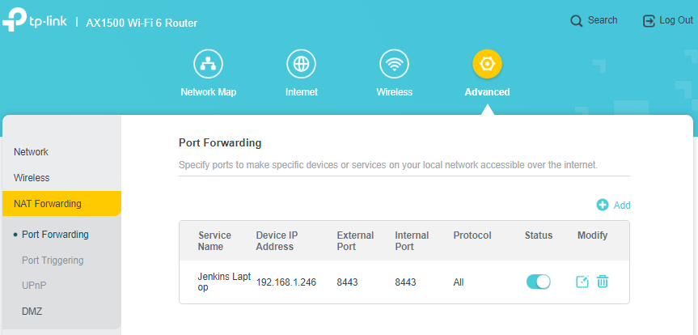

The problem is, that Jenkins cannot be accessed from outside the local Windows on the LAN. We want to access Jenkins from anywhere on the LAN, because if we can do that then we can also further configure our setup to be available from the internet!
WSL2 cannot be accessed from the LAN because the Ubuntu host is connected virtually to the Windows host and the Windows host is NAT-ing the Ubuntu hosts IP address.
You can imagine it like WSL connected to Windows through a wire, and Windows to the LAN.
We have to change that. We want to access Jenkins from the internet, because at some point the GitHub repo will be configured to send webhooks to our Jenkins, automatically triggering builds when needed.  

The following picture depicts what we want to achieve:


---

A little quote from the Microsoft documentation:

> When using a WSL 1 distribution, if your computer was set up to be accessed by your LAN, then applications run in WSL could be accessed on your LAN as well.
> 
> This isn't the default case in WSL 2. WSL 2 has a virtualized ethernet adapter with its own unique IP address. Currently, to enable this workflow you will need to go through the same steps as you would for a regular virtual machine. (We are looking into ways to improve this experience.)

Source: https://docs.microsoft.com/en-us/windows/wsl/networking

You can also follow this YouTube guide from David Bombal to give access to the WSL from anywhere on the LAN: https://www.youtube.com/watch?v=yCK3easuYm4  
He configures the wsl to be accessible for the remote desktop protocol, meaning Port 3389, but we will be doing it for the "secure" port 8443. Additionally we want to open up a port on our router and map the router's IP address to a registered host. 

---

# NO-IP

We will create a DNS Record on https://noip.com/. You will have to register on noip for this. Alternatively you can use any dynamic DNS Service, but for the sake of the exercise noip.com was chosen, because it's free for our purposes.  
Register on https://noip.com/, takes about 5 minutes...  
Once registered, open https://noip.com/, select Managed DNS from the top menu.  
Under My Services you will see DNS Records. Select it.  
Press Add a Hostname.  
You will be presented with a form, where the following information has to be filled:
- hostname,  like `myawesomejenkins`. This one is probably already taken, so think of a cool name! ddns.net can be changed if you wish, but it's irrelevant
- IP Address will be your router's IP Address. To find the IP Address of your router first disconnect from any VPNs (if you use any) and open  https://whatismyipaddress.com/. The IPv4 will be your IP Address.

Congratulations, you have created your hostname. You cannot use it yet, because further configuration is needed. Onwards to the router!

# Router Port Forwarding
This part will be specific to the router I am using. Every router vendor configures their router however they want, meaning that the administration website of the router might be available on different port, than the one I must use.  
My router is a `TP-Link AX1500 Wi-Fi 6 Router`, and it's admin website can be accessed by opening `http://192.168.1.1/` in a browser. Yours might be on a different IP. To carry on, you will have to find out the model of your router and based on that you should be able to easily find out the IP.

Here's how my Port Forwarding looks like on the router:

192.168.1.246 is my personal computer's IP address, and I am forwarding the external port 8443 to my computer to the same port number.
You should be able to configure this yourself on your router similarly.

# Bypassing Windows NAT

Here we want to make the WSL Instance available on the entire LAN. Since only your Windows can communicate with the WSL currently, nothing else can access the running Jenkins, including your Browser. This poses a problem, since if we cannot access Jenkins on the LAN from other devices (another PC for example on the same LAN) then the router can't access it either, thus making the port-forwarding obsolete.

1. open up WSL Ubuntu Distro and get the IP Address of the WSL Distro
```bash
ifconfig eth0 # hope it's still eth0, if not then just run ifconfig and find the appropriate network adapter
```
2. We're going to do a netsh proxy of ipv4 to ipv4, listen on port 8443 and we're going to allow from any IP address, we're going to connect on port 8443 on the IP address of the WSL Distro.

```powershell

netsh interface portproxy add v4tov4 listenport=8443 listenaddress=0.0.0.0 connectport=8443 connectaddress=UBUNTU_DISTRO_IP_ADDRESS
# Note that the IP address will change on reboot
# netsh interface portproxy show v4tov4
# netsh interface portproxy delete v4tov4 listenport=8443 listenaddress=0.0.0.0
 #>
```
Modify Windows defender advanced settings by adding port 8443 to be allowed inbound requests.


With all this done, you should be able to access your Jenkins from the internet by calling the https://yourregisteredhost:8443/jenkins in a browser. Obviously yourregisteredhost needs to be switched with the one you registered on https://noip.com/!